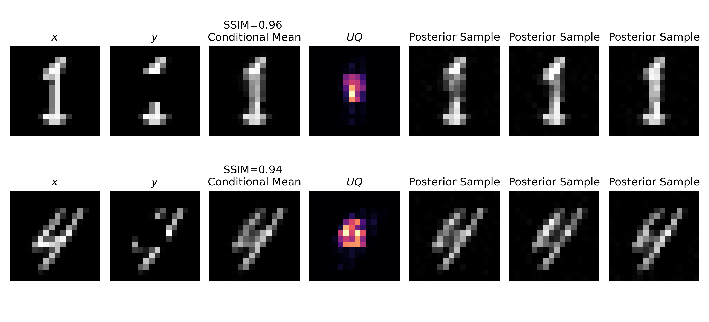

# InvertibleNetworks.jl

| **Documentation** | **Build Status**  |                  |
|:-----------------:|:-----------------:|:----------------:|
|[](https://slimgroup.github.io/InvertibleNetworks.jl/stable/) [](https://slimgroup.github.io/InvertibleNetworks.jl/dev/)| [](https://github.com/slimgroup/InvertibleNetworks.jl/actions/workflows/runtests.yml)| [](https://zenodo.org/badge/latestdoi/239018318)

Building blocks for invertible neural networks in the [Julia] programming language.

- Memory efficient building blocks for invertible neural networks
- Hand-derived gradients, Jacobians $J$ , and $\log |J|$
- [Flux] integration
- Support for [Zygote] and [ChainRules]
- GPU support
- Includes various examples of invertible neural networks, normalizing flows, variational inference, and uncertainty quantification


## Installation


InvertibleNetworks is registered and can be added like any standard julia package with the command:

```
] add InvertibleNetworks
```

## Getting started

### Conditional sampling
 A practical application of normalizing flows is solving inverse problems with uncertainty quantification. In a Bayesian framework, this is accomplished by training a conditional normalizing flow to sample from the posterior distribution. For quick training on CPU (around 4 minutes), we use the MNIST dataset and solve an inpainting problem. This is a minimal example, to run a complete training script refer to 
([Inpainting MNIST](https://github.com/slimgroup/InvertibleNetworks.jl/blob/cond_mnist/examples/conditional_sampling/mnist_inpainting.jl)). 

First we download and reshape our ground truth digits. Then we make observations by applying a masking forward operator `A` to the digits. 
```
using InvertibleNetworks, Flux, MLDatasets

Xs, _ = MNIST(split=:train)[1:2048];
Xs = Flux.unsqueeze(Xs, dims=3)
nx, ny, n_chan, n_train = size(Xs)

A = ones(Float32, nx, ny)
A[12:16,12:16] .= 0
Ys = A .* Xs;
```
The goal of the inverse problem is to recover the original digit `x` from an observation `y`. We train the conditional GLOW network to solve this problem. 
```
G = NetworkConditionalGlow();

opt = ADAM()
batch_size = 128
for epoch in 1:10
    for (X, Y) in Flux.DataLoader((Xs, Ys), batchsize=batch_size, partial=false)  # batch loop
        ZX, logdet_i = G.forward(X, Y);

        G.backward(ZX / batch_size, ZX, Y) # Set parameters of learned layers in G
        for p in get_params(G) 
        	Flux.update!(opt, p.data, p.grad)
        end
        clear_grad!(G) # Clear gradients unless you need to accumulate
    end
end
```
Now we can sample our trained conditional normalizing flow for an unseen data observation. 
```
X_test, _ = MNIST(split=:test)[1:1];
X_test = Flux.unsqueeze(X_test, dims=3)
y = A .* X_test[:,:,:,1:1]

num_samples = 64
Y_repeat = repeat(y, 1, 1, 1, num_samples) ;
ZX_noise = randn(Float32, nx, ny, n_chan, num_samples) 
X_post = G.inverse(ZX_noise, Y_repeat); # Make generative samples from posterior
```
By taking pointwise statistics of these posterior samples, we can study the uncertainty of the inverse problem. 
```
using Statistics
X_post_mean = mean(X_post; dims=4) 
X_post_var  = var(X_post;  dims=4)
```

Here are results from the training script with tweaked hyperparameters at ([Inpainting MNIST](https://github.com/slimgroup/InvertibleNetworks.jl/blob/cond_mnist/examples/conditional_sampling/mnist_inpainting.jl)). 




## Papers
The following publications use [InvertibleNetworks.jl]:

- **["Reliable amortized variational inference with physics-based latent distribution correction"]**
    - paper: [https://arxiv.org/abs/2207.11640](https://arxiv.org/abs/2207.11640)
    - [presentation](https://slim.gatech.edu/Publications/Public/Submitted/2022/siahkoohi2022ravi/slides.pdf)
    - code: [ReliableAVI.jl]

- **["Learning by example: fast reliability-aware seismic imaging with normalizing flows"]**
    - paper: [https://arxiv.org/abs/2104.06255](https://arxiv.org/abs/2104.06255)
    - [presentation](https://slim.gatech.edu/Publications/Public/Conferences/KAUST/2021/siahkoohi2021EarthMLfar/siahkoohi2021EarthMLfar.pdf)
    - code: [ReliabilityAwareImaging.jl]

- **["Enabling uncertainty quantification for seismic data pre-processing using normalizing flows (NF)—an interpolation example"]**
    - [paper](https://slim.gatech.edu/Publications/Public/Conferences/SEG/2021/kumar2021SEGeuq/kumar2021SEGeuq.pdf)
    - code: [WavefieldRecoveryUQ.jl]

- **["Preconditioned training of normalizing flows for variational inference in inverse problems"]**
    - paper: [https://arxiv.org/abs/2101.03709](https://arxiv.org/abs/2101.03709)
    - [presentation](https://slim.gatech.edu/Publications/Public/Conferences/AABI/2021/siahkoohi2021AABIpto/siahkoohi2021AABIpto_pres.pdf)
    - code: [FastApproximateInference.jl]

- **["Parameterizing uncertainty by deep invertible networks, an application to reservoir characterization"]**
    - paper: [https://arxiv.org/abs/2004.07871](https://arxiv.org/abs/2004.07871)
    - [presentation](https://slim.gatech.edu/Publications/Public/Conferences/SEG/2020/rizzuti2020SEGuqavp/rizzuti2020SEGuqavp_pres.pdf)
    - code: [https://github.com/slimgroup/Software.SEG2020](https://github.com/slimgroup/Software.SEG2020)

- **["Generalized Minkowski sets for the regularization of inverse problems"]**
    - paper: [http://arxiv.org/abs/1903.03942](http://arxiv.org/abs/1903.03942)
    - code: [SetIntersectionProjection.jl]

## Building blocks

- 1x1 Convolutions using Householder transformations ([example](https://github.com/slimgroup/InvertibleNetworks.jl/tree/master/examples/layers/layer_convolution_1x1.jl))

- Residual block ([example](https://github.com/slimgroup/InvertibleNetworks.jl/tree/master/examples/layers/layer_residual_block.jl))

- Invertible coupling layer from Dinh et al. (2017) ([example](https://github.com/slimgroup/InvertibleNetworks.jl/tree/master/examples/layers/layer_coupling_glow.jl))

- Invertible hyperbolic layer from Lensink et al. (2019) ([example](https://github.com/slimgroup/InvertibleNetworks.jl/tree/master/examples/layers/layer_coupling_hyperbolic.jl))

- Invertible coupling layer from Putzky and Welling (2019) ([example](https://github.com/slimgroup/InvertibleNetworks.jl/tree/master/examples/layers/layer_coupling_irim.jl))

- Invertible recursive coupling layer HINT from Kruse et al. (2020) ([example](https://github.com/slimgroup/InvertibleNetworks.jl/tree/master/examples/layers/layer_coupling_hint.jl))

- Activation normalization (Kingma and Dhariwal, 2018) ([example](https://github.com/slimgroup/InvertibleNetworks.jl/tree/master/examples/layers/layer_actnorm.jl))

- Various activation functions (Sigmoid, ReLU, leaky ReLU, GaLU)

- Objective and misfit functions (mean squared error, log-likelihood)

- Dimensionality manipulation: squeeze/unsqueeze (column, patch, checkerboard), split/cat

- Squeeze/unsqueeze using the wavelet transform


## Examples

- Invertible recurrent inference machines (Putzky and Welling, 2019) ([generic example](https://github.com/slimgroup/InvertibleNetworks.jl/tree/master/examples/networks/network_irim.jl))

- Generative models with maximum likelihood via the change of variable formula ([example](https://github.com/slimgroup/InvertibleNetworks.jl/tree/master/examples/applications/application_glow_banana_dist.jl))

- Glow: Generative flow with invertible 1x1 convolutions (Kingma and Dhariwal, 2018) ([generic example](https://github.com/slimgroup/InvertibleNetworks.jl/tree/master/examples/networks/network_glow.jl), [source](https://github.com/slimgroup/InvertibleNetworks.jl/tree/master/src/networks/invertible_network_glow.jl))

## GPU support

GPU support is supported via Flux/CuArray. To use the GPU, move the input and the network layer to GPU via `|> gpu`

```
using InvertibleNetworks, Flux

# Input
nx = 64
ny = 64
k = 10
batchsize = 4

# Input image: nx x ny x k x batchsize
X = randn(Float32, nx, ny, k, batchsize) |> gpu

# Activation normalization
AN = ActNorm(k; logdet=true) |> gpu

# Test invertibility
Y_, logdet = AN.forward(X)
```

## Acknowledgments

This package uses functions from [NNlib.jl](https://github.com/FluxML/NNlib.jl), [Flux.jl](https://github.com/FluxML/Flux.jl) and [Wavelets.jl](https://github.com/JuliaDSP/Wavelets.jl)


## References

 - Yann Dauphin, Angela Fan, Michael Auli and David Grangier, "Language modeling with gated convolutional networks", Proceedings of the 34th International Conference on Machine Learning, 2017. https://arxiv.org/pdf/1612.08083.pdf

 - Laurent Dinh, Jascha Sohl-Dickstein and Samy Bengio, "Density estimation using Real NVP",  International Conference on Learning Representations, 2017, https://arxiv.org/abs/1605.08803

 - Diederik P. Kingma and Prafulla Dhariwal, "Glow: Generative Flow with Invertible 1x1 Convolutions", Conference on Neural Information Processing Systems, 2018. https://arxiv.org/abs/1807.03039

 - Keegan Lensink, Eldad Haber and Bas Peters, "Fully Hyperbolic Convolutional Neural Networks", arXiv Computer Vision and Pattern Recognition, 2019. https://arxiv.org/abs/1905.10484

 - Patrick Putzky and Max Welling, "Invert to learn to invert", Advances in Neural Information Processing Systems, 2019. https://arxiv.org/abs/1911.10914

 - Jakob Kruse, Gianluca Detommaso, Robert Scheichl and Ullrich Köthe, "HINT: Hierarchical Invertible Neural Transport for Density Estimation and Bayesian Inference", arXiv Statistics and Machine Learning, 2020. https://arxiv.org/abs/1905.10687

## Authors

 - Philipp Witte, Georgia Institute of Technolgy (now Microsoft)

 - Gabrio Rizzuti, Utrecht University

 - Mathias Louboutin, Georgia Institute of Technology

 - Ali Siahkoohi, Georgia Institute of Technology (now Rice University)

 - Rafael Orozco, Georgia Institute of Technology

[Flux]:https://fluxml.ai
[Julia]:https://julialang.org
[Zygote]:https://github.com/FluxML/Zygote.jl
[ChainRules]:https://github.com/JuliaDiff/ChainRules.jl
[InvertibleNetworks.jl]:https://github.com/slimgroup/InvertibleNetworks.jl
["Learning by example: fast reliability-aware seismic imaging with normalizing flows"]:https://slim.gatech.edu/content/learning-example-fast-reliability-aware-seismic-imaging-normalizing-flows
["Enabling uncertainty quantification for seismic data pre-processing using normalizing flows (NF)—an interpolation example"]:https://slim.gatech.edu/content/ultra-low-memory-seismic-inversion-randomized-trace-estimation-0
["Preconditioned training of normalizing flows for variational inference in inverse problems"]:https://slim.gatech.edu/content/preconditioned-training-normalizing-flows-variational-inference-inverse-problems
[ReliabilityAwareImaging.jl]:https://github.com/slimgroup/Software.SEG2021/tree/main/ReliabilityAwareImaging.jl
[WavefieldRecoveryUQ.jl]:https://github.com/slimgroup/Software.SEG2021/tree/main/WavefieldRecoveryUQ.jl
[FastApproximateInference.jl]:https://github.com/slimgroup/Software.siahkoohi2021AABIpto
["Generalized Minkowski sets for the regularization of inverse problems"]:https://slim.gatech.edu/content/generalized-minkowski-sets-regularization-inverse-problems-1
[SetIntersectionProjection.jl]:https://github.com/slimgroup/SetIntersectionProjection.jl
["Parameterizing uncertainty by deep invertible networks, an application to reservoir characterization"]:https://slim.gatech.edu/content/parameterizing-uncertainty-deep-invertible-networks-application-reservoir-characterization
["Reliable amortized variational inference with physics-based latent distribution correction"]:https://slim.gatech.edu/content/reliable-amortized-variational-inference-physics-based-latent-distribution-correction
[ReliableAVI.jl]:https://github.com/slimgroup/ReliableAVI.jl
